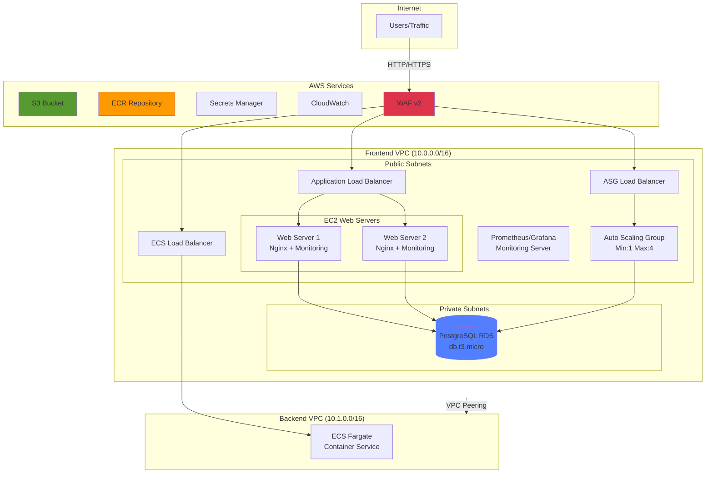

# AWS-Terraform Infrastructure Learning Lab


> Production-quality AWS infrastructure featuring EC2, ECS, RDS, Auto Scaling, comprehensive monitoring with Prometheus/Grafana, and complete CI/CD automation.

## 📖 Table of Contents

- [Architecture](#architecture)
- [Features](#features)
- [Tech Stack](#tech-stack)
- [Prerequisites](#prerequisites)
- [Quick Start](#quick-start)
- [Infrastructure Components](#infrastructure-components)
- [Environments](#environments)
- [Monitoring](#monitoring)
- [CI/CD Pipeline](#cicd-pipeline)
- [Cost Management](#cost-management)
- [Troubleshooting](#troubleshooting)

## 🏗️ Architecture

### Frontend VPC (10.0.0.0/16)


## ✨ Features

### Infrastructure
- **Multi-VPC Architecture**: Separate frontend (10.0.0.0/16) and backend (10.1.0.0/16) VPCs with peering
- **High Availability**: Multi-AZ deployment across us-west-2a, us-west-2b
- **Auto Scaling**: Dynamic scaling based on CPU metrics (1-4 instances)
- **Container Orchestration**: ECS with Fargate for serverless containers
- **Load Balancing**: 3 Application Load Balancers (static EC2, ASG, ECS)

### Security
- **WAF Protection**: AWS WAF v2 with managed rule sets and rate limiting
- **Private Subnets**: RDS isolated in private subnets
- **Secrets Management**: RDS passwords stored in AWS Secrets Manager
- **Security Groups**: Least-privilege access controls
- **Encrypted Storage**: S3 and RDS encryption at rest

### Monitoring
- **Prometheus**: Metrics collection with EC2 service discovery
- **Grafana**: Custom dashboards for visualization
- **CloudWatch**: Logs, metrics, alarms, and dashboards
- **Node Exporter**: Host-level metrics on all EC2 instances
- **CloudWatch Exporter**: RDS metrics integration

### CI/CD
- **GitHub Actions**: Automated Terraform validation and deployment
- **Terraform Cloud**: Remote state management with workspaces
- **Ansible Automation**: Server configuration management
- **Sentinel Policies**: Governance and compliance checks

## 🛠️ Tech Stack

**Infrastructure as Code:**
- Terraform 1.13+ with Terraform Cloud
- Terraform AWS VPC Module 6.5.0
- Terraform AWS S3 Module 5.8.0

**AWS Services:**
- **Compute**: EC2 (t2.micro/t2.small), Auto Scaling, ECS Fargate
- **Networking**: VPC, Subnets, Internet Gateway, NAT Gateway, VPC Peering
- **Load Balancing**: Application Load Balancer (3 instances)
- **Database**: RDS PostgreSQL 15 (db.t3.micro, 20GB)
- **Storage**: S3, ECR
- **Security**: WAF v2, Security Groups, Secrets Manager, IAM
- **Monitoring**: CloudWatch (Logs, Metrics, Alarms, Dashboards)

**Configuration Management:**
- Ansible 2.15+ with AWS EC2 dynamic inventory
- Playbooks: Nginx, CloudWatch Agent, Node Exporter, PostgreSQL client

**Monitoring Stack:**
- Prometheus 3.8.1 (EC2 service discovery)
- Grafana (visualization and alerting)
- Node Exporter 1.7.0
- CloudWatch Exporter (RDS metrics)

**Containerization:**
- Docker
- Amazon ECR (private registry)
- Amazon ECS with Fargate

## 📋 Prerequisites

### Required Tools

```bash
# Terraform
terraform --version  # >= 1.13

# AWS CLI
aws --version  # >= 2.0

# Ansible
ansible --version  # >= 2.15
ansible-galaxy collection install amazon.aws

# Python with boto3
python3 --version  # >= 3.9
pip install boto3 botocore

# Docker (for ECS deployments)
docker --version  # >= 20.10
```

### Required Credentials

1. **AWS Credentials**
   ```bash
   export AWS_ACCESS_KEY_ID="your_key"
   export AWS_SECRET_ACCESS_KEY="your_secret"
   export AWS_DEFAULT_REGION="us-west-2"
   ```

2. **Terraform Cloud**
   - Organization: `js_learninglab_hcp`
   - Workspaces: `AWS-Terraform-dev`, `AWS-Terraform-prod`
   - API Token: Generate from https://app.terraform.io

3. **SSH Key Pair**
   ```bash
   ssh-keygen -t rsa -b 4096
   export TF_VAR_ec2_ssh_public_key="$(cat ~/.ssh/id_rsa.pub)"
   ```

## 🚀 Quick Start

### 1. Clone Repository
```bash
git clone https://github.com/js_learninglab_hcp/AWS-Terraform.git
cd AWS-Terraform
```

### 2. Initialize Terraform
```bash
terraform init
```

### 3. Select Workspace
```bash
# For dev
terraform workspace select AWS-Terraform-dev

# For prod
terraform workspace select AWS-Terraform-prod
```

### 4. Deploy Infrastructure
```bash
# Review changes
terraform plan -var-file=dev.tfvars

# Apply
terraform apply -var-file=dev.tfvars

# Get outputs
terraform output
```

### 5. Configure with Ansible
```bash
cd Ansible

# Run playbook
ansible-playbook -i Inventory/aws_ec2.yml Playbooks/site.yml \
  -e "s3_bucket_name=$(terraform output -raw a_s3_bucket_name)" \
  -e "environment=dev"
```

### 6. Access Services
```bash
# Web Application
echo "http://$(terraform output -raw a_web_lb_dns_name)"

# Prometheus
terraform output a_prometheus_url

# Grafana  
terraform output a_grafana_url
```

## 📦 Infrastructure Components

<!-- BEGIN_TF_DOCS -->
## Requirements

| Name | Version |
|------|---------|
| <a name="requirement_terraform"></a> [terraform](#requirement\_terraform) | >= 1.2 |
| <a name="requirement_aws"></a> [aws](#requirement\_aws) | ~> 6.0 |
| <a name="requirement_google"></a> [google](#requirement\_google) | ~> 6.0 |
| <a name="requirement_random"></a> [random](#requirement\_random) | ~> 3.5 |

## Providers

| Name | Version |
|------|---------|
| <a name="provider_aws"></a> [aws](#provider\_aws) | 6.18.0 |
| <a name="provider_random"></a> [random](#provider\_random) | 3.7.2 |

## Modules

| Name | Source | Version |
|------|--------|---------|
| <a name="module_aws_s3"></a> [aws\_s3](#module\_aws\_s3) | terraform-aws-modules/s3-bucket/aws | ~> 5.8.0 |
| <a name="module_aws_vpc"></a> [aws\_vpc](#module\_aws\_vpc) | terraform-aws-modules/vpc/aws | ~> 6.5.0 |
| <a name="module_aws_vpc_backend"></a> [aws\_vpc\_backend](#module\_aws\_vpc\_backend) | terraform-aws-modules/vpc/aws | ~> 6.5.0 |

## Resources

| Name | Type |
|------|------|
| [aws_autoscaling_group.aws_autoscaling_group](https://registry.terraform.io/providers/hashicorp/aws/latest/docs/resources/autoscaling_group) | resource |
| [aws_autoscaling_policy.asg_scale_in_policy](https://registry.terraform.io/providers/hashicorp/aws/latest/docs/resources/autoscaling_policy) | resource |
| [aws_autoscaling_policy.asg_scale_out_policy](https://registry.terraform.io/providers/hashicorp/aws/latest/docs/resources/autoscaling_policy) | resource |
| [aws_cloudwatch_dashboard.js_learninglab_dashboard](https://registry.terraform.io/providers/hashicorp/aws/latest/docs/resources/cloudwatch_dashboard) | resource |
| [aws_cloudwatch_log_group.aws_cloudwatch_access_log_group](https://registry.terraform.io/providers/hashicorp/aws/latest/docs/resources/cloudwatch_log_group) | resource |
| [aws_cloudwatch_log_group.aws_cloudwatch_error_log_group](https://registry.terraform.io/providers/hashicorp/aws/latest/docs/resources/cloudwatch_log_group) | resource |
| [aws_cloudwatch_log_group.aws_ecs_cluster_log_group](https://registry.terraform.io/providers/hashicorp/aws/latest/docs/resources/cloudwatch_log_group) | resource |
| [aws_cloudwatch_log_metric_filter.count_404_errors](https://registry.terraform.io/providers/hashicorp/aws/latest/docs/resources/cloudwatch_log_metric_filter) | resource |
| [aws_cloudwatch_log_metric_filter.count_500_errors](https://registry.terraform.io/providers/hashicorp/aws/latest/docs/resources/cloudwatch_log_metric_filter) | resource |
| [aws_cloudwatch_metric_alarm.alarm_404_errors](https://registry.terraform.io/providers/hashicorp/aws/latest/docs/resources/cloudwatch_metric_alarm) | resource |
| [aws_cloudwatch_metric_alarm.alarm_500_errors](https://registry.terraform.io/providers/hashicorp/aws/latest/docs/resources/cloudwatch_metric_alarm) | resource |
| [aws_cloudwatch_metric_alarm.alb_unhealthy_host](https://registry.terraform.io/providers/hashicorp/aws/latest/docs/resources/cloudwatch_metric_alarm) | resource |
| [aws_cloudwatch_metric_alarm.asg_cpu_high_alarm](https://registry.terraform.io/providers/hashicorp/aws/latest/docs/resources/cloudwatch_metric_alarm) | resource |
| [aws_cloudwatch_metric_alarm.asg_cpu_low_alarm](https://registry.terraform.io/providers/hashicorp/aws/latest/docs/resources/cloudwatch_metric_alarm) | resource |
| [aws_cloudwatch_metric_alarm.high_5xx_errors](https://registry.terraform.io/providers/hashicorp/aws/latest/docs/resources/cloudwatch_metric_alarm) | resource |
| [aws_cloudwatch_metric_alarm.high_cpu_utilization](https://registry.terraform.io/providers/hashicorp/aws/latest/docs/resources/cloudwatch_metric_alarm) | resource |
| [aws_cloudwatch_metric_alarm.slow_response_time](https://registry.terraform.io/providers/hashicorp/aws/latest/docs/resources/cloudwatch_metric_alarm) | resource |
| [aws_db_instance.a_rds_instance](https://registry.terraform.io/providers/hashicorp/aws/latest/docs/resources/db_instance) | resource |
| [aws_db_subnet_group.a_rds_subnet_group](https://registry.terraform.io/providers/hashicorp/aws/latest/docs/resources/db_subnet_group) | resource |
| [aws_ecr_lifecycle_policy.a_ecr_lifecycle_policy](https://registry.terraform.io/providers/hashicorp/aws/latest/docs/resources/ecr_lifecycle_policy) | resource |
| [aws_ecr_repository.a_ecr_repo](https://registry.terraform.io/providers/hashicorp/aws/latest/docs/resources/ecr_repository) | resource |
| [aws_ecs_cluster.a_ecs_cluster](https://registry.terraform.io/providers/hashicorp/aws/latest/docs/resources/ecs_cluster) | resource |
| [aws_ecs_service.a_ecs_service](https://registry.terraform.io/providers/hashicorp/aws/latest/docs/resources/ecs_service) | resource |
| [aws_ecs_task_definition.a_ecs_task_definition](https://registry.terraform.io/providers/hashicorp/aws/latest/docs/resources/ecs_task_definition) | resource |
| [aws_iam_instance_profile.a_allow_prom_graf_scrape_profile](https://registry.terraform.io/providers/hashicorp/aws/latest/docs/resources/iam_instance_profile) | resource |
| [aws_iam_instance_profile.a_allow_web_servers_s3_profile](https://registry.terraform.io/providers/hashicorp/aws/latest/docs/resources/iam_instance_profile) | resource |
| [aws_iam_role.a_allow_prom_graf_scrape](https://registry.terraform.io/providers/hashicorp/aws/latest/docs/resources/iam_role) | resource |
| [aws_iam_role.a_allow_web_servers_s3](https://registry.terraform.io/providers/hashicorp/aws/latest/docs/resources/iam_role) | resource |
| [aws_iam_role.a_ecs_task_execution_role](https://registry.terraform.io/providers/hashicorp/aws/latest/docs/resources/iam_role) | resource |
| [aws_iam_role.a_ecs_task_role](https://registry.terraform.io/providers/hashicorp/aws/latest/docs/resources/iam_role) | resource |
| [aws_iam_role_policy.a_allow_cloudwatch_agent_policy](https://registry.terraform.io/providers/hashicorp/aws/latest/docs/resources/iam_role_policy) | resource |
| [aws_iam_role_policy.a_allow_prom_graf_scrape_policy](https://registry.terraform.io/providers/hashicorp/aws/latest/docs/resources/iam_role_policy) | resource |
| [aws_iam_role_policy.a_allow_web_servers_s3_policy](https://registry.terraform.io/providers/hashicorp/aws/latest/docs/resources/iam_role_policy) | resource |
| [aws_iam_role_policy.a_allow_web_servers_secrets_manager_policy](https://registry.terraform.io/providers/hashicorp/aws/latest/docs/resources/iam_role_policy) | resource |
| [aws_iam_role_policy.a_ecs_task_s3_access_policy](https://registry.terraform.io/providers/hashicorp/aws/latest/docs/resources/iam_role_policy) | resource |
| [aws_iam_role_policy_attachment.a_ecs_task_execution_role_policy_attachment](https://registry.terraform.io/providers/hashicorp/aws/latest/docs/resources/iam_role_policy_attachment) | resource |
| [aws_instance.a_prom_graf_server](https://registry.terraform.io/providers/hashicorp/aws/latest/docs/resources/instance) | resource |
| [aws_instance.a_web_servers](https://registry.terraform.io/providers/hashicorp/aws/latest/docs/resources/instance) | resource |
| [aws_key_pair.a_ec2_ssh_key](https://registry.terraform.io/providers/hashicorp/aws/latest/docs/resources/key_pair) | resource |
| [aws_launch_template.asg_aws_launch_template](https://registry.terraform.io/providers/hashicorp/aws/latest/docs/resources/launch_template) | resource |
| [aws_lb.a_web_lb](https://registry.terraform.io/providers/hashicorp/aws/latest/docs/resources/lb) | resource |
| [aws_lb.asg_web_lb](https://registry.terraform.io/providers/hashicorp/aws/latest/docs/resources/lb) | resource |
| [aws_lb.ecs_web_lb](https://registry.terraform.io/providers/hashicorp/aws/latest/docs/resources/lb) | resource |
| [aws_lb_listener.a_web_lb_listener](https://registry.terraform.io/providers/hashicorp/aws/latest/docs/resources/lb_listener) | resource |
| [aws_lb_listener.asg_web_lb_listener](https://registry.terraform.io/providers/hashicorp/aws/latest/docs/resources/lb_listener) | resource |
| [aws_lb_listener.ecs_web_lb_listener](https://registry.terraform.io/providers/hashicorp/aws/latest/docs/resources/lb_listener) | resource |
| [aws_lb_target_group.a_web_lb_tg](https://registry.terraform.io/providers/hashicorp/aws/latest/docs/resources/lb_target_group) | resource |
| [aws_lb_target_group.asg_web_lb_tg](https://registry.terraform.io/providers/hashicorp/aws/latest/docs/resources/lb_target_group) | resource |
| [aws_lb_target_group.ecs_web_lb_tg](https://registry.terraform.io/providers/hashicorp/aws/latest/docs/resources/lb_target_group) | resource |
| [aws_lb_target_group_attachment.a_web_lb_tg_attach](https://registry.terraform.io/providers/hashicorp/aws/latest/docs/resources/lb_target_group_attachment) | resource |
| [aws_route.backend_private_to_frontend](https://registry.terraform.io/providers/hashicorp/aws/latest/docs/resources/route) | resource |
| [aws_route.backend_public_to_frontend](https://registry.terraform.io/providers/hashicorp/aws/latest/docs/resources/route) | resource |
| [aws_route.frontend_private_to_backend](https://registry.terraform.io/providers/hashicorp/aws/latest/docs/resources/route) | resource |
| [aws_route.frontend_public_to_backend](https://registry.terraform.io/providers/hashicorp/aws/latest/docs/resources/route) | resource |
| [aws_s3_bucket_policy.a_s3_bucket_policy](https://registry.terraform.io/providers/hashicorp/aws/latest/docs/resources/s3_bucket_policy) | resource |
| [aws_s3_object.a_s3_website_content](https://registry.terraform.io/providers/hashicorp/aws/latest/docs/resources/s3_object) | resource |
| [aws_secretsmanager_secret.a_rds_password_secret](https://registry.terraform.io/providers/hashicorp/aws/latest/docs/resources/secretsmanager_secret) | resource |
| [aws_secretsmanager_secret_version.a_rds_password_secret_version](https://registry.terraform.io/providers/hashicorp/aws/latest/docs/resources/secretsmanager_secret_version) | resource |
| [aws_security_group.a_prom_graf_sg](https://registry.terraform.io/providers/hashicorp/aws/latest/docs/resources/security_group) | resource |
| [aws_security_group.a_rds_sg](https://registry.terraform.io/providers/hashicorp/aws/latest/docs/resources/security_group) | resource |
| [aws_security_group.a_web_lb_sg](https://registry.terraform.io/providers/hashicorp/aws/latest/docs/resources/security_group) | resource |
| [aws_security_group.a_web_sg](https://registry.terraform.io/providers/hashicorp/aws/latest/docs/resources/security_group) | resource |
| [aws_security_group.ecs_web_lb_sg](https://registry.terraform.io/providers/hashicorp/aws/latest/docs/resources/security_group) | resource |
| [aws_security_group.ecs_web_sg](https://registry.terraform.io/providers/hashicorp/aws/latest/docs/resources/security_group) | resource |
| [aws_security_group_rule.a_prom_graf_sg_rule](https://registry.terraform.io/providers/hashicorp/aws/latest/docs/resources/security_group_rule) | resource |
| [aws_sns_topic.cpu_utilization_alerts](https://registry.terraform.io/providers/hashicorp/aws/latest/docs/resources/sns_topic) | resource |
| [aws_sns_topic_subscription.cpu_utilization_alerts_subscription](https://registry.terraform.io/providers/hashicorp/aws/latest/docs/resources/sns_topic_subscription) | resource |
| [aws_vpc_peering_connection.a_vpc_peering](https://registry.terraform.io/providers/hashicorp/aws/latest/docs/resources/vpc_peering_connection) | resource |
| [aws_wafv2_web_acl.a_web_lb_waf](https://registry.terraform.io/providers/hashicorp/aws/latest/docs/resources/wafv2_web_acl) | resource |
| [aws_wafv2_web_acl_association.a_web_lb_asg_waf_assoc](https://registry.terraform.io/providers/hashicorp/aws/latest/docs/resources/wafv2_web_acl_association) | resource |
| [aws_wafv2_web_acl_association.a_web_lb_waf_assoc](https://registry.terraform.io/providers/hashicorp/aws/latest/docs/resources/wafv2_web_acl_association) | resource |
| [random_integer.random_number](https://registry.terraform.io/providers/hashicorp/random/latest/docs/resources/integer) | resource |
| [random_password.rds_password](https://registry.terraform.io/providers/hashicorp/random/latest/docs/resources/password) | resource |
| [aws_ami.linux](https://registry.terraform.io/providers/hashicorp/aws/latest/docs/data-sources/ami) | data source |
| [aws_ami.windows](https://registry.terraform.io/providers/hashicorp/aws/latest/docs/data-sources/ami) | data source |
| [aws_availability_zones.available](https://registry.terraform.io/providers/hashicorp/aws/latest/docs/data-sources/availability_zones) | data source |
| [aws_elb_service_account.root](https://registry.terraform.io/providers/hashicorp/aws/latest/docs/data-sources/elb_service_account) | data source |

## Inputs

| Name | Description | Type | Default | Required |
|------|-------------|------|---------|:--------:|
| <a name="input_ec2_ssh_public_key"></a> [ec2\_ssh\_public\_key](#input\_ec2\_ssh\_public\_key) | Public key for SSH access to EC2 instances. | `string` | n/a | yes |
| <a name="input_asg_aws_server_count_desired"></a> [asg\_aws\_server\_count\_desired](#input\_asg\_aws\_server\_count\_desired) | number of aws autoscaling group instances desired | `number` | `2` | no |
| <a name="input_asg_aws_server_count_max"></a> [asg\_aws\_server\_count\_max](#input\_asg\_aws\_server\_count\_max) | number of aws autoscaling group instances max | `number` | `4` | no |
| <a name="input_asg_aws_server_count_min"></a> [asg\_aws\_server\_count\_min](#input\_asg\_aws\_server\_count\_min) | number of aws autoscaling group instances min | `number` | `1` | no |
| <a name="input_aws_common_tags"></a> [aws\_common\_tags](#input\_aws\_common\_tags) | Common tag Project for all AWS resources. | `map(string)` | <pre>{<br>  "Owner": "Juli",<br>  "Project": "AWS-TF"<br>}</pre> | no |
| <a name="input_aws_instance_type"></a> [aws\_instance\_type](#input\_aws\_instance\_type) | The EC2 instance's type. | `string` | `"t2.micro"` | no |
| <a name="input_aws_naming_prefix"></a> [aws\_naming\_prefix](#input\_aws\_naming\_prefix) | Naming prefix for all resources | `string` | `"JSLearningLab"` | no |
| <a name="input_aws_protocol_tcp"></a> [aws\_protocol\_tcp](#input\_aws\_protocol\_tcp) | The TCP protocol. | `string` | `"tcp"` | no |
| <a name="input_aws_rds_allocated_storage"></a> [aws\_rds\_allocated\_storage](#input\_aws\_rds\_allocated\_storage) | The allocated storage for the RDS database in GB. | `number` | `20` | no |
| <a name="input_aws_rds_backup_retention_period"></a> [aws\_rds\_backup\_retention\_period](#input\_aws\_rds\_backup\_retention\_period) | The backup retention period for the RDS instance in days. | `number` | `7` | no |
| <a name="input_aws_rds_db_name"></a> [aws\_rds\_db\_name](#input\_aws\_rds\_db\_name) | The name of the RDS database. | `string` | `"jslearninglabdb"` | no |
| <a name="input_aws_rds_engine"></a> [aws\_rds\_engine](#input\_aws\_rds\_engine) | The database engine for the RDS instance. | `string` | `"postgres"` | no |
| <a name="input_aws_rds_engine_version"></a> [aws\_rds\_engine\_version](#input\_aws\_rds\_engine\_version) | The database engine version for the RDS instance. | `string` | `"15"` | no |
| <a name="input_aws_rds_instance_class"></a> [aws\_rds\_instance\_class](#input\_aws\_rds\_instance\_class) | The instance class for the RDS instance. | `string` | `"db.t3.micro"` | no |
| <a name="input_aws_rds_master_username"></a> [aws\_rds\_master\_username](#input\_aws\_rds\_master\_username) | The master username for the RDS database. | `string` | `"JSDBadmin"` | no |
| <a name="input_aws_region"></a> [aws\_region](#input\_aws\_region) | AWS us-west-2 region | `string` | `"us-west-2"` | no |
| <a name="input_aws_s3_bucket_name"></a> [aws\_s3\_bucket\_name](#input\_aws\_s3\_bucket\_name) | The name of the S3 bucket. | `string` | `"S3storage"` | no |
| <a name="input_aws_tcp_22"></a> [aws\_tcp\_22](#input\_aws\_tcp\_22) | The TCP port 22 for SSH. | `number` | `22` | no |
| <a name="input_aws_tcp_3000"></a> [aws\_tcp\_3000](#input\_aws\_tcp\_3000) | The TCP port 3000 for Grafana UI. | `number` | `3000` | no |
| <a name="input_aws_tcp_443"></a> [aws\_tcp\_443](#input\_aws\_tcp\_443) | The TCP port 443 for HTTPS. | `number` | `443` | no |
| <a name="input_aws_tcp_80"></a> [aws\_tcp\_80](#input\_aws\_tcp\_80) | The TCP port 80 for HTTP. | `number` | `80` | no |
| <a name="input_aws_tcp_9090"></a> [aws\_tcp\_9090](#input\_aws\_tcp\_9090) | The TCP port 9090 for Prometheus UI. | `number` | `9090` | no |
| <a name="input_aws_tcp_9100"></a> [aws\_tcp\_9100](#input\_aws\_tcp\_9100) | The TCP port 9100 for Prometheus to scrape metrics. | `number` | `9100` | no |
| <a name="input_aws_tcp_9106"></a> [aws\_tcp\_9106](#input\_aws\_tcp\_9106) | The TCP port 9106 for cloudwatch exporter. | `number` | `9106` | no |
| <a name="input_aws_tcp_all"></a> [aws\_tcp\_all](#input\_aws\_tcp\_all) | All TCP ports. | `string` | `"0"` | no |
| <a name="input_aws_us_west_regions"></a> [aws\_us\_west\_regions](#input\_aws\_us\_west\_regions) | The availability zone for the AWS resources. | `list(string)` | <pre>[<br>  "us-west-2a",<br>  "us-west-2b",<br>  "us-west-2c"<br>]</pre> | no |
| <a name="input_aws_vpc_backend_cidr"></a> [aws\_vpc\_backend\_cidr](#input\_aws\_vpc\_backend\_cidr) | The cidr for the AWS backend VPC. | `string` | `"10.1.0.0/16"` | no |
| <a name="input_aws_vpc_cidr"></a> [aws\_vpc\_cidr](#input\_aws\_vpc\_cidr) | The cidr for the AWS VPC. | `string` | `"10.0.0.0/16"` | no |
| <a name="input_aws_vpc_enable_dns_hostnames"></a> [aws\_vpc\_enable\_dns\_hostnames](#input\_aws\_vpc\_enable\_dns\_hostnames) | Enable DNS hostnames in the VPC. | `bool` | `true` | no |
| <a name="input_aws_web_instance_name"></a> [aws\_web\_instance\_name](#input\_aws\_web\_instance\_name) | Value of the EC2 instance's Name tag. | `string` | `"aws-web-terraform"` | no |
| <a name="input_aws_web_server_count"></a> [aws\_web\_server\_count](#input\_aws\_web\_server\_count) | number of web\_server instances | `number` | `2` | no |
| <a name="input_aws_web_subnet_count"></a> [aws\_web\_subnet\_count](#input\_aws\_web\_subnet\_count) | number of aws web subnets | `number` | `2` | no |
| <a name="input_common_tags"></a> [common\_tags](#input\_common\_tags) | Common tag Project for all resources. | `map(string)` | `{}` | no |
| <a name="input_ecs_container_image"></a> [ecs\_container\_image](#input\_ecs\_container\_image) | Docker Image for ECS containers | `string` | `"nginx:alpine"` | no |
| <a name="input_elb_service_account_arn"></a> [elb\_service\_account\_arn](#input\_elb\_service\_account\_arn) | The AWS ELB service account ARN. | `string` | `"arn:aws:iam::127311923021:root"` | no |
| <a name="input_environment"></a> [environment](#input\_environment) | Environment identifier | `string` | `"dev"` | no |
| <a name="input_gcp_app_instance_name"></a> [gcp\_app\_instance\_name](#input\_gcp\_app\_instance\_name) | value of the compute engine's name | `string` | `"gcp-app-terraform"` | no |
| <a name="input_gcp_app_server_count"></a> [gcp\_app\_server\_count](#input\_gcp\_app\_server\_count) | number of app\_server instances | `number` | `0` | no |
| <a name="input_gcp_boot_disk_size"></a> [gcp\_boot\_disk\_size](#input\_gcp\_boot\_disk\_size) | The size of the boot disk in GB. | `number` | `20` | no |
| <a name="input_gcp_db_instance_name"></a> [gcp\_db\_instance\_name](#input\_gcp\_db\_instance\_name) | value of the compute engine's name | `string` | `"gcp-db-terraform"` | no |
| <a name="input_gcp_db_server_count"></a> [gcp\_db\_server\_count](#input\_gcp\_db\_server\_count) | number of db\_server instances | `number` | `0` | no |
| <a name="input_gcp_image_family"></a> [gcp\_image\_family](#input\_gcp\_image\_family) | The image family of the operating system to use. | `string` | `"windows-cloud/windows-2022"` | no |
| <a name="input_gcp_image_project"></a> [gcp\_image\_project](#input\_gcp\_image\_project) | The project where the image family belongs. | `string` | `"windows-cloud"` | no |
| <a name="input_gcp_instance_type"></a> [gcp\_instance\_type](#input\_gcp\_instance\_type) | The EC2 instance's type. | `string` | `"t2.micro"` | no |
| <a name="input_gcp_region"></a> [gcp\_region](#input\_gcp\_region) | GCP us-west1 region | `string` | `"us-west1"` | no |
| <a name="input_gcp_vpc_region"></a> [gcp\_vpc\_region](#input\_gcp\_vpc\_region) | The region for the GCP VPC. | `string` | `"us-west1"` | no |
| <a name="input_gcp_vpc_subnets"></a> [gcp\_vpc\_subnets](#input\_gcp\_vpc\_subnets) | The cidr for the GCP VPC subnet. | `list(string)` | <pre>[<br>  "11.0.1.0/24",<br>  "11.0.2.0/24"<br>]</pre> | no |
| <a name="input_juli_public_ip"></a> [juli\_public\_ip](#input\_juli\_public\_ip) | a list of my public IP addresses for SSH access | `list(string)` | <pre>[<br>  "167.103.62.209/32"<br>]</pre> | no |

## Outputs

| Name | Description |
|------|-------------|
| <a name="output_a_grafana_url"></a> [a\_grafana\_url](#output\_a\_grafana\_url) | The URL to access the Grafana server |
| <a name="output_a_prometheus_grafana_public_dns"></a> [a\_prometheus\_grafana\_public\_dns](#output\_a\_prometheus\_grafana\_public\_dns) | The public DNS of the Prometheus Grafana server |
| <a name="output_a_prometheus_url"></a> [a\_prometheus\_url](#output\_a\_prometheus\_url) | The URL to access the Prometheus server |
| <a name="output_a_rds_instance_db_name"></a> [a\_rds\_instance\_db\_name](#output\_a\_rds\_instance\_db\_name) | The database name |
| <a name="output_a_rds_instance_endpoint"></a> [a\_rds\_instance\_endpoint](#output\_a\_rds\_instance\_endpoint) | The endpoint of the RDS instance |
| <a name="output_a_rds_instance_master_username"></a> [a\_rds\_instance\_master\_username](#output\_a\_rds\_instance\_master\_username) | The master username of the RDS instance |
| <a name="output_a_rds_instance_port"></a> [a\_rds\_instance\_port](#output\_a\_rds\_instance\_port) | The port of the RDS instance |
| <a name="output_a_rds_instance_secret_name"></a> [a\_rds\_instance\_secret\_name](#output\_a\_rds\_instance\_secret\_name) | The name of the Secrets Manager secret for the RDS password |
| <a name="output_a_s3_bucket_name"></a> [a\_s3\_bucket\_name](#output\_a\_s3\_bucket\_name) | The name of the S3 bucket |
| <a name="output_a_web_lb_dns_name"></a> [a\_web\_lb\_dns\_name](#output\_a\_web\_lb\_dns\_name) | The DNS name of the load balancer |
| <a name="output_a_web_servers_public_dns_url"></a> [a\_web\_servers\_public\_dns\_url](#output\_a\_web\_servers\_public\_dns\_url) | The public DNS names of the web server(s) |
| <a name="output_a_web_servers_public_ip_url"></a> [a\_web\_servers\_public\_ip\_url](#output\_a\_web\_servers\_public\_ip\_url) | The URL to access the web server(s) |
| <a name="output_a_web_servers_subnet_id"></a> [a\_web\_servers\_subnet\_id](#output\_a\_web\_servers\_subnet\_id) | the Subnet ID of the web server(s) |
| <a name="output_a_web_servers_vpc_id"></a> [a\_web\_servers\_vpc\_id](#output\_a\_web\_servers\_vpc\_id) | the VPC ID of the web server(s) |
| <a name="output_asg_web_lb_dns_name"></a> [asg\_web\_lb\_dns\_name](#output\_asg\_web\_lb\_dns\_name) | The DNS name of the ASG load balancer |
| <a name="output_ecr_repository_name"></a> [ecr\_repository\_name](#output\_ecr\_repository\_name) | ECR repository name |
| <a name="output_repository_url"></a> [repository\_url](#output\_repository\_url) | ECR repository URL |
<!-- END_TF_DOCS -->

## 🌍 Environments

### Dev Environment
- **Workspace**: `AWS-Terraform-dev`
- **Config**: `dev.tfvars`
- **Purpose**: Development and testing
- **Instance Type**: `t2.micro`
- **Cost**: Destroyed daily to save costs

### Prod Environment
- **Workspace**: `AWS-Terraform-prod`
- **Config**: `prod.tfvars`
- **Purpose**: Production workloads
- **Instance Type**: `t2.micro` (upgradeable)
- **High Availability**: Multi-AZ, persistent

## 📊 Monitoring

### Prometheus (Port 9090)
- **Metrics Collection**: 15-second intervals
- **Service Discovery**: AWS EC2 tags
- **Exporters**: Node Exporter (host), CloudWatch Exporter (RDS)
- **Retention**: 15 days

### Grafana (Port 3000)
- **Default Login**: admin/admin
- **Data Sources**: Prometheus, CloudWatch
- **Dashboards**: EC2, RDS, ALB metrics
- **Alerting**: Email notifications via SNS

### CloudWatch
- **Log Groups**: Nginx access/error (7-day retention)
- **Metrics**: CPU, disk, network, application errors
- **Alarms**:
  - High CPU (>50%)
  - Unhealthy targets
  - 5XX errors (>10)
  - 404/500 error rates (>5/5min)
  - Slow response time (>2s)
- **Dashboard**: Real-time metrics visualization

## 🔄 CI/CD Pipeline

### Workflows

**Terraform Dev** (on push to `dev`)
- Checkout → Init → Format → Validate
- Uses workspace: `AWS-Terraform-dev`

**Terraform Prod** (on push to `main`)
- Checkout → Init → Format → Validate  
- Uses workspace: `AWS-Terraform-prod`

**Ansible Deploy** (manual trigger)
- Select environment (dev/prod)
- Fetch Terraform outputs
- Configure servers:
  - Install Nginx
  - Setup CloudWatch Agent
  - Deploy Node Exporter
  - Configure PostgreSQL client
  - Deploy Prometheus config

### Sentinel Policies
- **restrict-ec2-instance-type**: Advisory enforcement
- Validates instance types against approved list

## 💰 Cost Management

### Monthly Estimates (24/7 operation)

| Service | Config | Cost |
|---------|--------|------|
| EC2 (3x t2.micro + 1x t2.small) | Web + Monitoring | ~$30 |
| Auto Scaling (0-4x t2.micro) | Variable | ~$0-30 |
| RDS (db.t3.micro) | PostgreSQL | ~$15 |
| NAT Gateway (2x) | Multi-AZ | ~$64 |
| ALB (3x) | Load Balancers | ~$48 |
| S3 + Data Transfer | Storage | ~$5 |
| ECS Fargate | Containers (when used) | Variable |
| **Total (max)** | | **~$162-192/month** |

### Cost Savings
✅ Destroy infrastructure daily ($0/night)  
✅ Use t2.micro free tier eligible  
✅ Disable NAT Gateways when not needed  
✅ Short CloudWatch log retention  
✅ Lifecycle policies for ECR images  

## 🐛 Troubleshooting

### Terraform Issues

**State Lock:**
```bash
terraform force-unlock <LOCK_ID>
```

**Provider Conflicts:**
```bash
terraform init -upgrade
```

### Ansible Issues

**SSH Timeout:**
- Verify security group allows GitHub Actions IPs
- Check EC2 instances are running
- Verify SSH key matches

**Empty Inventory:**
```bash
# Test inventory
ansible-inventory -i Inventory/aws_ec2.yml --graph

# Verify AWS credentials
aws ec2 describe-instances --region us-west-2
```

### Application Issues

**502 Bad Gateway:**
1. Check ALB target health
2. Verify security groups
3. Check Nginx: `sudo systemctl status nginx`
4. Review logs: `sudo journalctl -u nginx`

**RDS Connection Failed:**
1. Verify security group allows EC2 → RDS (5432)
2. Check RDS in private subnet
3. Test: `psql -h <endpoint> -U JSDBadmin -d jslearninglabdb`
4. Verify Secrets Manager password

**ECS Tasks Not Starting:**
1. Check ECR image exists
2. Verify task role has ECR permissions
3. Check CloudWatch logs: `/ecs/<cluster>/<task>`
4. Verify security groups allow ALB → ECS

## 📁 Project Structure

```
AWS-Terraform/
├── .github/workflows/          # CI/CD pipelines
├── Ansible/                    # Configuration management
│   ├── Inventory/             # Dynamic inventory
│   └── Playbooks/             # Ansible playbooks
├── Policy/                     # Sentinel policies
├── Templates/                  # User data scripts
├── website/                    # Static content
├── main.tf                     # Main resources
├── variables.tf                # Variable definitions
├── outputs.tf                  # Output values
├── locals.tf                   # Local values
├── terraform.tf                # Provider config
├── networking.tf               # VPC resources
├── security-group.tf           # Security groups
├── iam.tf                      # IAM roles/policies
├── database.tf                 # RDS configuration
├── monitoring.tf               # CloudWatch resources
├── autoscaling.tf              # ASG configuration
├── Loadbalancer.tf             # ALB resources
├── ecs.tf                      # ECS/Fargate
├── waf.tf                      # WAF configuration
├── dev.tfvars                  # Dev variables
└── prod.tfvars                 # Prod variables
```

## 🎓 Learning Journey

This project demonstrates:
- ✅ Multi-VPC architecture with peering
- ✅ ECS container orchestration
- ✅ Comprehensive monitoring stack
- ✅ WAF security implementation
- ✅ Auto Scaling with CloudWatch
- ✅ CI/CD automation
- ✅ Infrastructure as Code best practices

## 🎯 Roadmap

- [x] EC2 + Auto Scaling
- [x] RDS PostgreSQL
- [x] Prometheus + Grafana
- [x] ECS + Fargate
- [x] WAF Protection
- [x] VPC Peering
- [ ] Multi-region deployment
- [ ] Route53 + ACM (SSL/TLS)
- [ ] Advanced Grafana dashboards
- [ ] Backup and DR strategy
- [ ] AWS Solutions Architect cert

## 📝 License

Educational project - JS Learning Lab

## 👤 Author

**Juli** - js_learninglab_hcp  
DevOps Learning Journey

---

⭐ **Star this repo if you found it helpful!**

*Last updated: Auto-generated by terraform-docs*
