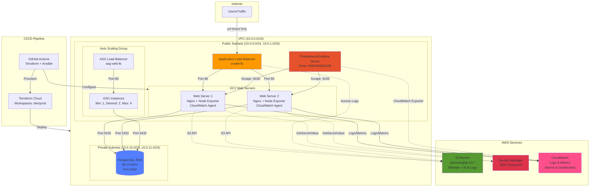

# AWS-Terraform Infrastructure Learning Lab


> Production-quality AWS infrastructure built with Terraform, featuring multi-environment setup, auto-scaling, monitoring with Prometheus/Grafana, and full CI/CD automation.

## 📖 Table of Contents

- [Architecture](#architecture)
- [Features](#features)
- [Tech Stack](#tech-stack)
- [Prerequisites](#prerequisites)
- [Quick Start](#quick-start)
- [Infrastructure Components](#infrastructure-components)
- [Environments](#environments)
- [Monitoring](#monitoring)
- [CI/CD Pipeline](#cicd-pipeline)
- [Cost Management](#cost-management)
- [Troubleshooting](#troubleshooting)

## 🏗️ Architecture



## ✨ Features

- **Infrastructure as Code**: Complete Terraform configuration for AWS resources
- **Multi-Environment**: Separate dev/prod workspaces managed via Terraform Cloud
- **High Availability**: Multi-AZ deployment with Application Load Balancers
- **Auto Scaling**: Dynamic EC2 scaling based on CPU metrics (1-4 instances)
- **Database**: PostgreSQL RDS in private subnets with encrypted passwords in Secrets Manager
- **Monitoring Stack**: 
  - Prometheus for metrics collection
  - Grafana for visualization
  - CloudWatch for AWS-native monitoring
  - Node Exporter for host metrics
- **Configuration Management**: Ansible playbooks for automated server setup
- **CI/CD Pipeline**: GitHub Actions with Terraform Cloud integration
- **Security**:
  - Private subnets for databases
  - Security groups with least privilege
  - Secrets Manager for sensitive data
  - NAT Gateways for private subnet internet access
- **Logging**: Centralized CloudWatch log groups for Nginx access/error logs

## 🛠️ Tech Stack

**Infrastructure:**
- Terraform 1.13+ with Terraform Cloud
- AWS VPC Module (6.5.0)
- AWS S3 Module (5.8.0)

**AWS Services:**
- **Compute**: EC2 (t2.micro), Auto Scaling Groups, Launch Templates
- **Networking**: VPC, Subnets, Internet Gateway, NAT Gateway, Application Load Balancer
- **Database**: RDS PostgreSQL 15 (db.t3.micro)
- **Storage**: S3 (website content, ALB logs)
- **Security**: Security Groups, IAM Roles/Policies, Secrets Manager
- **Monitoring**: CloudWatch (Logs, Metrics, Alarms, Dashboards)

**Configuration Management:**
- Ansible 2.15+
- Dynamic inventory with AWS EC2 plugin
- Playbooks for Nginx, CloudWatch Agent, Node Exporter, PostgreSQL client

**Monitoring:**
- Prometheus 3.8.1 (metrics collection with EC2 service discovery)
- Grafana (visualization)
- CloudWatch Exporter (RDS metrics)
- Node Exporter 1.7.0 (host metrics)

**CI/CD:**
- GitHub Actions
- Terraform Cloud (state management, Sentinel policies)

## 📋 Prerequisites

### Required Tools

```bash
# Terraform
terraform --version  # >= 1.13

# AWS CLI
aws --version  # >= 2.0

# Ansible
ansible --version  # >= 2.15
ansible-galaxy collection install amazon.aws

# Python (for Ansible AWS modules)
python3 --version  # >= 3.9
pip install boto3 botocore
```

### Required Credentials

1. **AWS Credentials**
   ```bash
   export AWS_ACCESS_KEY_ID="your_key"
   export AWS_SECRET_ACCESS_KEY="your_secret"
   export AWS_DEFAULT_REGION="us-west-2"
   ```

2. **Terraform Cloud Token**
   - Sign up at https://app.terraform.io
   - Create organization: `js_learninglab_hcp`
   - Create workspaces: `AWS-Terraform-dev`, `AWS-Terraform-prod`
   - Generate API token

3. **SSH Key Pair**
   ```bash
   ssh-keygen -t rsa -b 4096 -C "your_email@example.com"
   export TF_VAR_ec2_ssh_public_key="$(cat ~/.ssh/id_rsa.pub)"
   ```

### AWS IAM Permissions

Your AWS user needs permissions for:
- EC2, VPC, RDS, S3, IAM
- CloudWatch, Secrets Manager
- Auto Scaling, Load Balancing

## 🚀 Quick Start

### 1. Clone Repository

```bash
git clone https://github.com/js_learninglab_hcp/AWS-Terraform.git
cd AWS-Terraform
```

### 2. Configure Environment

```bash
# Set AWS credentials
export AWS_ACCESS_KEY_ID="your_access_key"
export AWS_SECRET_ACCESS_KEY="your_secret_key"
export AWS_DEFAULT_REGION="us-west-2"

# Set Terraform Cloud token
export TF_CLOUD_TOKEN="your_tf_cloud_token"

# Set SSH public key
export TF_VAR_ec2_ssh_public_key="$(cat ~/.ssh/id_rsa.pub)"
```

### 3. Initialize Terraform

```bash
terraform init
```

### 4. Select Workspace

```bash
# For dev environment
terraform workspace select AWS-Terraform-dev

# For prod environment
terraform workspace select AWS-Terraform-prod
```

### 5. Plan & Apply Infrastructure

```bash
# Review changes
terraform plan -var-file=dev.tfvars

# Apply infrastructure
terraform apply -var-file=dev.tfvars

# Note outputs
terraform output
```

### 6. Configure Servers with Ansible

```bash
cd Ansible

# Verify inventory
ansible-inventory -i Inventory/aws_ec2.yml --list

# Run configuration playbook
ansible-playbook -i Inventory/aws_ec2.yml Playbooks/site.yml \
  -e "s3_bucket_name=$(terraform output -raw a_s3_bucket_name)" \
  -e "environment=dev" \
  -e "aws_region=us-west-2"
```

### 7. Access Your Infrastructure

```bash
# Get ALB DNS
terraform output a_web_lb_dns_name
# Visit: http://<alb-dns-name>

# Get monitoring URLs
terraform output a_prometheus_url  # Port 9090
terraform output a_grafana_url     # Port 3000 (admin/admin)
```

## 📦 Infrastructure Components

<!-- BEGIN_TF_DOCS -->
This section is automatically generated by terraform-docs.
<!-- END_TF_DOCS -->

## 🌍 Environments

### Dev Environment
- **Workspace**: `AWS-Terraform-dev`
- **Config**: `dev.tfvars`
- **Instance Type**: `t2.micro`
- **Purpose**: Testing and development
- **Cost Optimization**: Destroy daily when not in use

### Prod Environment
- **Workspace**: `AWS-Terraform-prod`
- **Config**: `prod.tfvars`
- **Instance Type**: `t2.micro` (can be upgraded)
- **Purpose**: Production workloads
- **High Availability**: Multi-AZ deployment

## 📊 Monitoring

### Prometheus
- **URL**: `http://<prometheus-ip>:9090`
- **Metrics Collection**: 15-second scrape interval
- **Service Discovery**: AWS EC2 tags (Project: AWS-TF, Owner: Juli)
- **Targets**: 
  - Node Exporter (port 9100) on all EC2 instances
  - CloudWatch Exporter (port 9106) for RDS metrics

### Grafana
- **URL**: `http://<grafana-ip>:3000`
- **Default Credentials**: admin/admin (change on first login)
- **Data Sources**: Prometheus, CloudWatch
- **Pre-configured Dashboards**: EC2 metrics, RDS metrics, ALB performance

### CloudWatch
- **Log Groups**:
  - `nginx_access_logs-dev` (7-day retention)
  - `nginx_error_logs-dev` (7-day retention)
- **Alarms**:
  - High CPU utilization (>50%)
  - Disk read/write thresholds (>1GB)
  - Unhealthy ALB targets
  - High 5XX errors (>10)
  - Slow response time (>2 seconds)
  - 404/500 error rates
- **Dashboard**: Custom CloudWatch dashboard with EC2 CPU, 404/500 errors

### Custom Metrics
- **404 Error Count**: Log metric filter on access logs
- **500 Error Count**: Log metric filter on error logs
- **Alarms**: Triggered at >5 errors per 5 minutes

## 🔄 CI/CD Pipeline

### GitHub Actions Workflows

#### 1. Terraform Dev (`.github/workflows/AWS-terraform-dev.yml`)
- **Trigger**: Push/PR to `dev` branch
- **Steps**:
  - Checkout code
  - Setup Terraform with Terraform Cloud credentials
  - `terraform init`
  - `terraform fmt -check`
  - `terraform validate`
- **Workspace**: `AWS-Terraform-dev`

#### 2. Terraform Prod (`.github/workflows/AWS-terraform-prod.yml`)
- **Trigger**: Push/PR to `main` branch
- **Steps**: Same as dev workflow
- **Workspace**: `AWS-Terraform-prod`

#### 3. Ansible Deploy (`.github/workflows/AWS-ansible.yml`)
- **Trigger**: Manual (`workflow_dispatch`)
- **Environment Selection**: Choose dev or prod
- **Steps**:
  - Fetch Terraform outputs (S3 bucket, RDS config)
  - Setup SSH keys
  - Install Ansible + AWS dependencies
  - Run playbooks:
    - `nginx.yml` - Install and configure Nginx
    - `cloudwatchagent.yml` - Setup CloudWatch Agent
    - `nodeexporter.yml` - Install Node Exporter
    - `rdsclientsetup.yml` - Configure PostgreSQL client
    - `deployprometheus.yml` - Configure Prometheus

### Deployment Flow

```
Developer → Push to dev → CI validates → Manual review → Merge to main → CI validates → Manual deploy
```

### Sentinel Policies
- **Policy**: `restrict-ec2-instance-type.sentinel`
- **Enforcement**: Advisory
- **Purpose**: Validate EC2 instance types against allowed list

## 💰 Cost Management

### Cost-Saving Practices
- ✅ Destroy infrastructure daily when not actively learning
- ✅ Use `t2.micro` instances (free tier eligible for first year)
- ✅ Single NAT Gateway option (can be disabled to save ~$32/month)
- ✅ 7-day CloudWatch log retention (vs 30+ days)
- ✅ On-demand pricing (no long-term commitments)

### Estimated Monthly Costs (24/7 operation)

| Service | Configuration | Monthly Cost |
|---------|---------------|--------------|
| EC2 (2x t2.micro) | Web servers | ~$15 |
| EC2 (1x t2.small) | Prometheus/Grafana | ~$15 |
| RDS (db.t3.micro) | PostgreSQL | ~$15 |
| NAT Gateway | 1x Multi-AZ | ~$32 |
| Application Load Balancer | 2x ALBs | ~$32 |
| S3 Storage | ~5GB | ~$0.12 |
| Data Transfer | Minimal | ~$2 |
| **Total** | | **~$111/month** |

**Note**: Can reduce to ~$79/month by disabling NAT Gateway (requires manual bastion access)

### Destroy Infrastructure

```bash
# Destroy when not in use
terraform destroy -var-file=dev.tfvars

# Or selectively destroy expensive resources
terraform destroy -target=module.aws_vpc.aws_nat_gateway.this
```

## 🐛 Troubleshooting

### Terraform Issues

**State Lock Error:**
```bash
# Check Terraform Cloud for locks
# Force unlock (use with extreme caution)
terraform force-unlock <LOCK_ID>
```

**Provider Version Conflicts:**
```bash
# Upgrade providers
terraform init -upgrade

# Or delete lock file and reinit
rm .terraform.lock.hcl
terraform init
```

**Module Errors:**
```bash
# Re-download modules
terraform init -upgrade

# Clear module cache
rm -rf .terraform/modules
terraform init
```

### Ansible Connection Issues

**SSH Connection Timeout:**
```bash
# Verify security group allows SSH from GitHub Actions IPs
# Temporarily use 0.0.0.0/0 for debugging (then restrict!)

# Test SSH manually
ssh -i ~/.ssh/id_rsa ec2-user@<ec2-public-ip>
```

**Dynamic Inventory Empty:**
```bash
# Test inventory
ansible-inventory -i Inventory/aws_ec2.yml --graph

# Verify AWS credentials
aws ec2 describe-instances --region us-west-2

# Check EC2 tags match filters in aws_ec2.yml
```

**Python/Boto3 Errors:**
```bash
# Install required packages
pip install boto3 botocore
ansible-galaxy collection install amazon.aws
```

### Application Issues

**502 Bad Gateway from ALB:**
1. Check target group health in AWS Console
2. Verify security groups allow ALB → EC2 traffic (port 80)
3. Check Nginx status: `sudo systemctl status nginx`
4. View Nginx logs: `sudo journalctl -u nginx -f`
5. Verify user data script completed: `sudo cat /var/log/cloud-init-output.log`

**Cannot Connect to RDS:**
1. Verify security group allows EC2 → RDS (port 5432)
2. Confirm RDS is in private subnet (not publicly accessible)
3. Test connection:
   ```bash
   psql -h <rds-endpoint> -U JSDBadmin -d jslearninglabdb
   ```
4. Check Secrets Manager for correct password

**CloudWatch Logs Not Appearing:**
1. Verify CloudWatch Agent is running: `sudo systemctl status amazon-cloudwatch-agent`
2. Check agent config: `/opt/aws/amazon-cloudwatch-agent/etc/amazon-cloudwatch-agent.json`
3. View agent logs: `sudo journalctl -u amazon-cloudwatch-agent`
4. Verify IAM role has CloudWatch permissions

**Prometheus Not Scraping Targets:**
1. Check Prometheus UI: `http://<prometheus-ip>:9090/targets`
2. Verify security group allows Prometheus → EC2 (port 9100)
3. Test Node Exporter: `curl http://<ec2-ip>:9100/metrics`
4. Check Prometheus config: `/etc/prometheus/prometheus.yml`
5. Restart Prometheus: `sudo systemctl restart prometheus`

## 📁 Project Structure

```
AWS-Terraform/
├── .github/
│   └── workflows/
│       ├── AWS-terraform-dev.yml      # Dev environment CI
│       ├── AWS-terraform-prod.yml     # Prod environment CI
│       └── AWS-ansible.yml            # Ansible deployment
├── Ansible/
│   ├── ansible.cfg                    # Ansible configuration
│   ├── Inventory/
│   │   └── aws_ec2.yml               # Dynamic EC2 inventory
│   └── Playbooks/
│       ├── site.yml                   # Main playbook
│       ├── nginx.yml                  # Nginx setup
│       ├── cloudwatchagent.yml        # CloudWatch agent
│       ├── nodeexporter.yml           # Node Exporter
│       ├── deployprometheus.yml       # Prometheus config
│       ├── rdsclientsetup.yml         # PostgreSQL client
│       └── configureprometheus.yml.j2 # Prometheus template
├── Policy/
│   ├── sentinel.hcl                   # Sentinel policy config
│   └── restrict-ec2-instance-type.sentinel
├── Templates/
│   ├── startupscript2.tpl            # EC2 user data
│   ├── installpython.tpl             # Python setup
│   ├── installpostgres.tpl           # PostgreSQL client
│   ├── installprometheus.tpl         # Prometheus installer
│   ├── installgrafana.tpl            # Grafana installer
│   ├── installcloudwatchexporter.tpl # CloudWatch exporter
│   └── cloudwatchagent-config.json.tpl
├── website/
│   ├── index.html                    # Website content
│   └── JS_learningLab.png           # Logo
├── main.tf                           # Main resources
├── variables.tf                      # Variable definitions
├── outputs.tf                        # Output values
├── locals.tf                         # Local values
├── terraform.tf                      # Provider config
├── networking.tf                     # VPC, subnets, routing
├── security-group.tf                 # Security groups
├── iam.tf                           # IAM roles and policies
├── database.tf                       # RDS configuration
├── monitoring.tf                     # CloudWatch resources
├── s3.tf                            # S3 bucket policy
├── Loadbalancer.tf                   # ALB for web servers
├── asg-loadbalancer.tf               # ALB for ASG
├── autoscaling.tf                    # Auto Scaling Group
├── dev.tfvars                        # Dev variables
└── prod.tfvars                       # Prod variables
```

## 🎓 Learning Journey

This project demonstrates hands-on experience with:

- ✅ **Infrastructure as Code**: Terraform best practices, modules, workspaces
- ✅ **AWS Services**: 15+ services including VPC, EC2, RDS, S3, ALB, CloudWatch
- ✅ **Configuration Management**: Ansible playbooks, dynamic inventory, Jinja2 templates
- ✅ **CI/CD**: GitHub Actions, automated testing, multi-environment deployment
- ✅ **Monitoring & Observability**: Prometheus, Grafana, CloudWatch integration
- ✅ **Security**: IAM roles, security groups, Secrets Manager, private subnets
- ✅ **Auto Scaling**: Launch templates, scaling policies, CloudWatch alarms
- ✅ **Networking**: VPC design, subnets, routing, NAT gateways, load balancers
- ✅ **Cost Optimization**: Resource tagging, daily destruction, rightsizing

## 🎯 Roadmap

### Completed ✅
- [x] Multi-environment Terraform setup (dev/prod)
- [x] VPC with public/private subnets
- [x] EC2 instances with Auto Scaling
- [x] RDS PostgreSQL with Secrets Manager
- [x] Application Load Balancers
- [x] S3 for static content and logs
- [x] Prometheus + Grafana monitoring
- [x] CloudWatch integration
- [x] Ansible automation
- [x] GitHub Actions CI/CD
- [x] Sentinel policy enforcement

### In Progress 🚧
- [ ] Complete README auto-generation
- [ ] Advanced Grafana dashboards

### Planned 🎯
- [ ] ECS/Fargate containerization
- [ ] Multi-region deployment
- [ ] Route53 DNS management
- [ ] SSL/TLS certificates (ACM)
- [ ] AWS WAF integration
- [ ] Backup and disaster recovery
- [ ] Advanced monitoring dashboards
- [ ] AWS Solutions Architect Associate certification

## 📝 License

This project is for educational purposes as part of a DevOps learning journey.

## 👤 Author

**Juli**
- Organization: js_learninglab_hcp  
- Project: AWS-TF Learning Lab
- Focus: Infrastructure as Code, DevOps, Cloud Engineering

---

**⭐ If you found this project helpful, please star the repository!**

Last updated: Auto-generated by terraform-docs